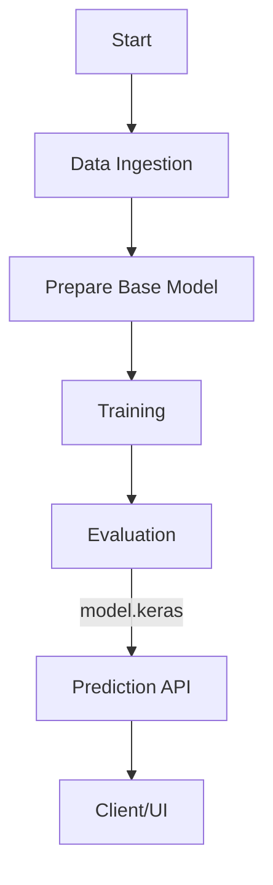

# 🐔 Chicken Disease Classification (CNN + DVC + Docker + Flask)

> End‑to‑end ML project for classifying **Coccidiosis vs Healthy** chickens using TensorFlow/Keras, orchestrated with **DVC** pipelines, containerized with **Docker**, and served via a minimal **Flask** API.


---

## 🔍 Overview

This repository demonstrates a clean, reproducible MLOps workflow:

- **Versioned data & pipelines** with DVC (`data_ingestion → base_model → training → evaluation`)
- **Config‑driven code** using `config.yaml` & `params.yaml`
- **Modular pipelines** (each stage is a small, testable unit)
- **Web app** for inference with Flask (`/train` and `/predict` routes)
- **Dockerized** for consistent deployments across machines/clouds

> Target labels: **`Coccidiosis`** and **`Healthy`**

---

## 🗂️ Project Structure

```
.
├── config/                     # configuration files (yaml)
├── src/Chicken_Disease_Classifier/
│   ├── components/             # data_ingestion, prepare_base_model, training, evaluation
│   ├── config/                 # configuration manager
│   ├── pipeline/               # stage_01..04 + predict
│   ├── utils/                  # helpers (e.g., image decode)
│   └── __init__.py
├── templates/                  # Flask templates (index.html)
├── app.py                      # Flask API (predict/train)
├── main.py                     # Orchestrates all stages
├── params.yaml                 # ML hyperparameters
├── config.yaml                 # Paths and data locations
├── dvc.yaml / .dvc/            # DVC pipelines & metadata
├── requirements.txt
├── Dockerfile
└── README.md
```

---

## 🧭 End‑to‑End Workflow

1. **Data Ingestion**
   - Downloads dataset (zip/tar) and extracts to `artifacts/data_ingestion/`
   - Inputs controlled by `config.yaml`
2. **Prepare Base Model**
   - Loads a pretrained CNN (e.g., EfficientNet/ResNet/MobileNet) and freezes/unfreezes layers
   - Saves `base_model.keras` in `artifacts/prepare_base_model/`
3. **Training**
   - Builds training & validation generators from `artifacts/data_ingestion/`
   - Trains using hyperparameters from `params.yaml`
   - Saves checkpoints & final `model.keras` to `artifacts/training/`
4. **Evaluation**
   - Runs evaluation against validation/test split
   - Persists metrics to `scores.json` under `artifacts/evaluation/`
5. **Prediction (Flask)**
   - `/predict`: accepts a base64 image, decodes, and returns predicted class
   - `/train`: kicks off the full pipeline (`main.py`) for retraining

> Every stage is callable independently and orchestrated end‑to‑end via `main.py` or `dvc repro`.

---

## ⚙️ Configuration Files

### `config.yaml` (example)
```yaml
artifacts_root: artifacts

data_ingestion:
  root_dir: artifacts/data_ingestion
  source_URL: "<public-or-authenticated-zip-url>"
  local_data_file: artifacts/data_ingestion/data.zip
  unzip_dir: artifacts/data_ingestion/data

prepare_base_model:
  root_dir: artifacts/prepare_base_model
  base_model_path: artifacts/prepare_base_model/base_model.keras
  updated_base_model_path: artifacts/prepare_base_model/updated_base_model.keras
  params_image_size: [224, 224, 3]
  params_weights: "imagenet"
  params_include_top: false
  params_classes: 2

training:
  root_dir: artifacts/training
  trained_model_path: artifacts/training/model.keras
  training_data: artifacts/data_ingestion/data/train
  validation_data: artifacts/data_ingestion/data/val
  callbacks_dir: artifacts/training/callbacks
```

### `params.yaml` (example)
```yaml
AUGMENTATION: true
IMAGE_SIZE: [224, 224, 3]
BATCH_SIZE: 32
EPOCHS: 20
LEARNING_RATE: 0.0005
LOSS_FUNCTION: "categorical_crossentropy"
METRICS: ["accuracy"]
```

> Tune only `params.yaml` to run new experiments without touching code.

---

## 🧩 Entities & Configuration Manager

- **Entities**: Typed dataclasses that represent each stage’s config (e.g., `DataIngestionConfig`, `PrepareBaseModelConfig`, `TrainingConfig`, `EvaluationConfig`).  
- **Configuration Manager**: A central utility that reads `config.yaml`/`params.yaml`, validates paths, and returns entity objects to components.

This pattern keeps components clean and improves testability.

---

## 🧱 Components

- **`DataIngestion`**: download → extract  
- **`PrepareBaseModel`**: load base model → freeze/unfreeze → save updated model  
- **`Training`**: create generators → compile model → train with callbacks (TensorBoard & checkpoints)  
- **`Evaluation`**: load model → evaluate → write `scores.json`  
- **`PredictionPipeline`**: load final `model.keras` → preprocess image → predict

Artifacts are written under `artifacts/<stage>/...` for traceable runs.

---

## ⛓️ DVC: Reproducible Pipelines

Initialize once:
```bash
dvc init
git add . && git commit -m "init dvc"
```

Run the whole pipeline with one command:
```bash
dvc repro
```

Visualize the DAG:
```bash
dvc dag
```

Cache and remote (optional):
```bash
dvc remote add -d origin <your-remote-storage>
dvc push   # push artifacts/metadata to remote
```

---

## 🚀 How to Run Locally

### 1) Environment
```bash
python -m venv venv
source venv/bin/activate   # Windows: venv\Scripts\activate
pip install -r requirements.txt
```

### 2) Reproduce the pipeline
```bash
# runs data_ingestion → prepare_base_model → training → evaluation
python main.py
# OR
dvc repro
```

### 3) Serve the API
```bash
python app.py
# Open: http://localhost:80  (adjust port if needed)
```

**Routes**
- `GET /` – returns the HTML UI
- `POST /train` – kicks off a full training run
- `POST /predict` – JSON with base64 image → returns predicted class

Example `curl`:
```bash
curl -X POST http://localhost:80/predict \
  -H "Content-Type: application/json" \
  -d "{\"image\":\"<base64-encoded-image>\"}"
```

---

## 🐳 Docker

### Build
```bash
docker build -t chicken-clf:latest .
```

### Run
```bash
docker run -p 80:80 chicken-clf:latest
```

> Use `-v` to mount a model directory or `--env` for configurable paths if needed.

---

## 🧪 Notes & Tips

- Keep your dataset pathing stable; use `config.yaml` to change locations without code edits.
- Track large datasets via **DVC remote** instead of Git LFS.
- Persisted metrics live in `scores.json` for easy CI checks.
- For cloud deploys, adjust `app.py` `host/port` and expose the correct container port.

---

## 📊 Example Outputs

- **Model**: `artifacts/training/model.keras`
- **Metrics**: `artifacts/evaluation/scores.json`
- **TensorBoard**: `artifacts/training/callbacks/tensorboard_log/`

Open TensorBoard:
```bash
tensorboard --logdir artifacts/training/callbacks/tensorboard_log
```

---

## 🛠️ Tech Stack

- **Python**, **TensorFlow/Keras**
- **Flask**
- **DVC**
- **Docker**
- (Optional) **GitHub Actions** / **Cloud (AWS/Azure/GCP)** for CI/CD

---

## 🗺️ Flowchart (Mermaid)

> Paste into a Markdown viewer that supports Mermaid (or use the Napkin prompt below).



---

## 🧾 Napkin / Prompt‑to‑Image (Flowchart Text)

```
Nodes:
  Start
  Data Ingestion
  Prepare Base Model
  Training
  Evaluation
  Prediction API
  Client/UI

Edges:
  Start -> Data Ingestion -> Prepare Base Model -> Training -> Evaluation -> Prediction API -> Client/UI

Notes:
  - Show artifacts folders under each stage (e.g., artifacts/data_ingestion, artifacts/training)
  - Distinguish model flow (model.keras) from data flow
  - Minimal, clean, modern style
```

---

## 📜 License

MIT — see `LICENSE`.

